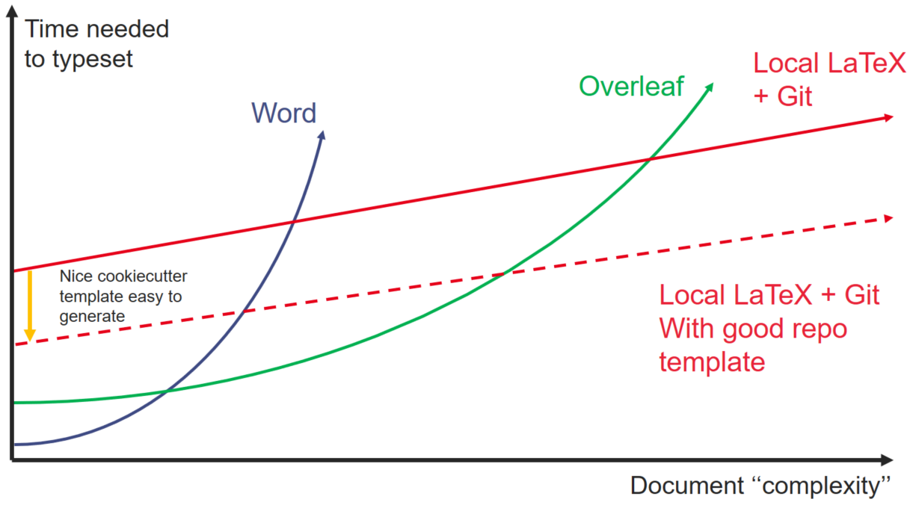
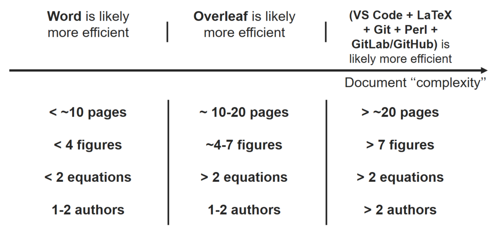
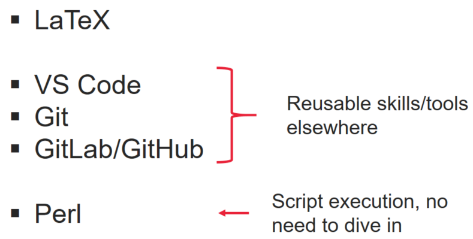

# LaTeX Template Cookiecutter

## Why use this template with the recommanded setup ?

For documents with high complexity due to lenght, mathematical expression or number of author, the time need to typeset is likely shorter using a setup based on local LaTeX management. Therefore, this approach can be difficult due to the compexity of the LaTeX ecosystem.

The template generator bring together the tools need to have a complete and clean LaTeX repo with interresting workflow for GitLab and GitHub improving teamwork.

Using many tools instead of an all-in-one like Overleaf and Word can seemed difficult because of the many skills required. But most of the tool/skills required can easily be usefull in other project.

## Quickstart

Install the latest Cookiecutter if you haven't installed it yet (this requires
Cookiecutter 1.4.0 or higher):

    pip install -U cookiecutter

Generate a Python package project:

    cookiecutter https://github.com/RobinsonBeaucour/LaTeX-Cookiecutter-Multi-template.git

The template follows the below structure :

------------

    ├── .gitignore                  <- Specifies files and directories that should be ignored by Git
    ├── .gitlab-ci.yml              <- If GitLab is selected at generation, define GitLab workflow
    ├── .github                     <- If GitHub is selected at generation, define GitHub workflow
    ├── main.tex                    <- Main tex file
    ├── README.md                   <- Description of the TeX project
    ├── ref.bib                     <- Contains bibliography references used in main.tex
    ├── 00_Scripts                  <- Contains perl scripts usefull to process TeX files
    ├── 01_(Chapters/Sections)      <- Contains chapters or sections used as input in main.tex
    ├── 02_Appendix                 <- Contains appendix used as input in main.tex
    └── 03_Images                   <- Contains images used as input in main.tex

## Recommanded setup

* Local IDE : [VS code](https://code.visualstudio.com/)

    With extensions
    * [LateX Workshop](https://marketplace.visualstudio.com/items?itemName=James-Yu.latex-workshop)

* Perl

    For Windows
    * [StrawberryPerl](https://strawberryperl.com/)

* TeX Distribution

    For Windows
    * [MikTex](https://miktex.org/)

## Perl Scripts

`00_Scripts` folder contains perl script usefull to process TeX file. See [Script documentation](./{{cookiecutter.project_name}}/00_Scripts/README.md) for more informations.

## GitHub Workflow

### build.yaml

This workflow is triggered on any changes in `main` branch.

The first job generate a concatenated TeX file and a word count.

The second job generate PDF from the concatenated TeX file.

The workflow can be manually triggered

### diff.yaml

This workflow is triggered on any changes in a branch that is in a pull request for `main` branch.

The first job generate a concatenated TeX file, a word count and a diff TeX file with `main.tex` from `main` branch.

The second job generate PDF from the concatenated new TeX file and the diff Tex file.

The workflow can be manually triggered

## GitLab Workflow

### process & build

This workflow is triggered on any changes in `main` branch.

The first job generate a concatenated TeX file and a word count.

The second job generate PDF from the concatenated TeX file.

The workflow can be manually triggered.

### diff_process & diff_build

This workflow is triggered on any changes in a branch that is in a pull request for `main` branch.

The first job generate a concatenated TeX file, a word count and a diff TeX file with `main.tex` from `main` branch.

The second job generate PDF from the concatenated new TeX file and the diff Tex file.

The workflow can be manually triggered.
